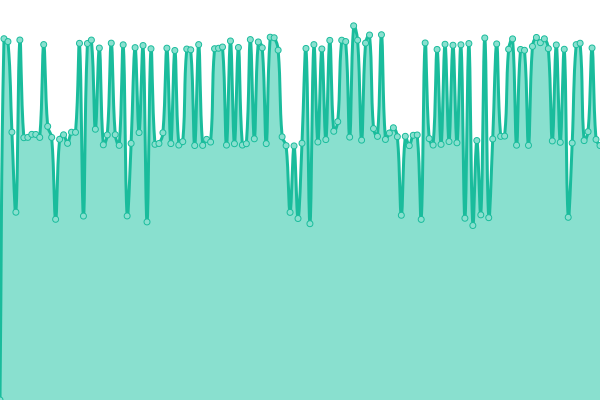

# [📈 Live Status](https://status.guya.moe): <!--live status--> **🟨 Degraded performance**

This repository contains the open-source uptime monitor and status page for [Subject F](https://status.guya.moe), powered by [Upptime](https://github.com/upptime/upptime).

With [Upptime](https://upptime.js.org), you can get your own unlimited and free uptime monitor and status page, powered entirely by a GitHub repository. We use [Issues](https://github.com/subject-f/guya-status-page/issues) as incident reports, [Actions](https://github.com/subject-f/guya-status-page/actions) as uptime monitors, and [Pages](https://status.guya.moe) for the status page.

<!--start: status pages-->
<!-- This summary is generated by Upptime (https://github.com/upptime/upptime) -->
<!-- Do not edit this manually, your changes will be overwritten -->
<!-- prettier-ignore -->
| URL | Status | History | Response Time | Uptime |
| --- | ------ | ------- | ------------- | ------ |
|  [Guya.moe](https://baka.guya.moe/) | 🟩 Up | [guya-moe.yml](https://github.com/subject-f/guya-status-page/commits/HEAD/history/guya-moe.yml) | 

 409ms
     
 | 

<a href="https://status.guya.moe/history/guya-moe">100.00%</a>
    

|  [Guya.moe Proxied](https://ice.guya.moe/) | 🟨 Degraded | [guya-moe-proxied.yml](https://github.com/subject-f/guya-status-page/commits/HEAD/history/guya-moe-proxied.yml) | 

 15529ms
     
 | 

<a href="https://status.guya.moe/history/guya-moe-proxied">0.00%</a>
    

<!--end: status pages-->

[**Visit our status website →**](https://status.guya.moe)

## 📄 License

- Powered by: [Upptime](https://github.com/upptime/upptime)
- Code: [MIT](./LICENSE) © [Subject F](https://status.guya.moe)
- Data in the `./history` directory: [Open Database License](https://opendatacommons.org/licenses/odbl/1-0/)
